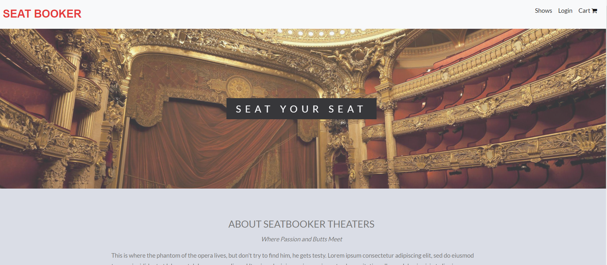
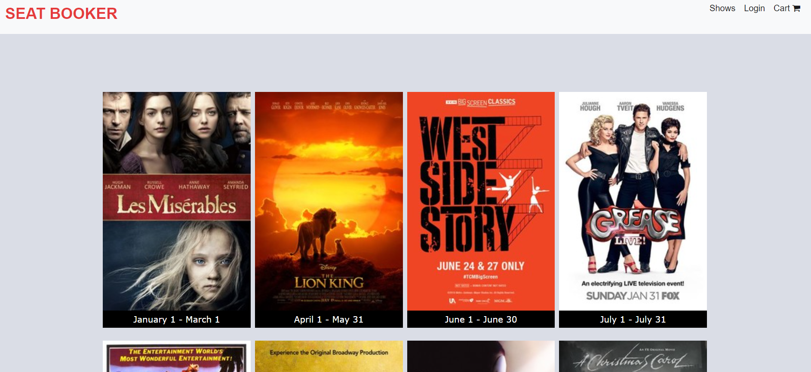
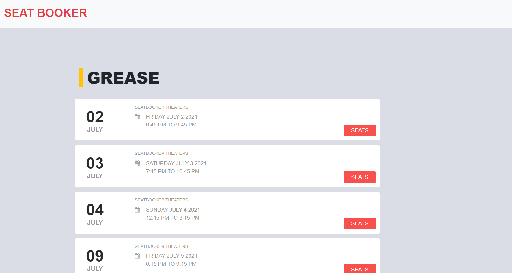

# Deployed Site on Heroku:

https://seat-booker.herokuapp.com/

# GitHub Repo:

https://github.com/Valborg1/seat-booker

# User Story

As a user, I can check the different showtimes for productions and showings at a theatre
As a user, I can create my own profile where I can see what I  have purchased with tickets
As a user, I want to checkout upcoming shows with description, showtimes, availability and pricing at our theatre. 

# Technology Used:
-Handlebars, CSS, JScript, NodeJs, Npm packages, MySQL
- This application allows users to select and book seats for their favorite shows with a secure account. 

# Test:

  

  

# Contributors:

Name: Jared Lim (jaredlim1@gmail.com), Jordan Shipley (jordan.j.shipley@gmail.com), Logan Felsted (logansfelsted@gmail.com), Sishir Bhattarai (sishir.bhattarai@outlook.com)